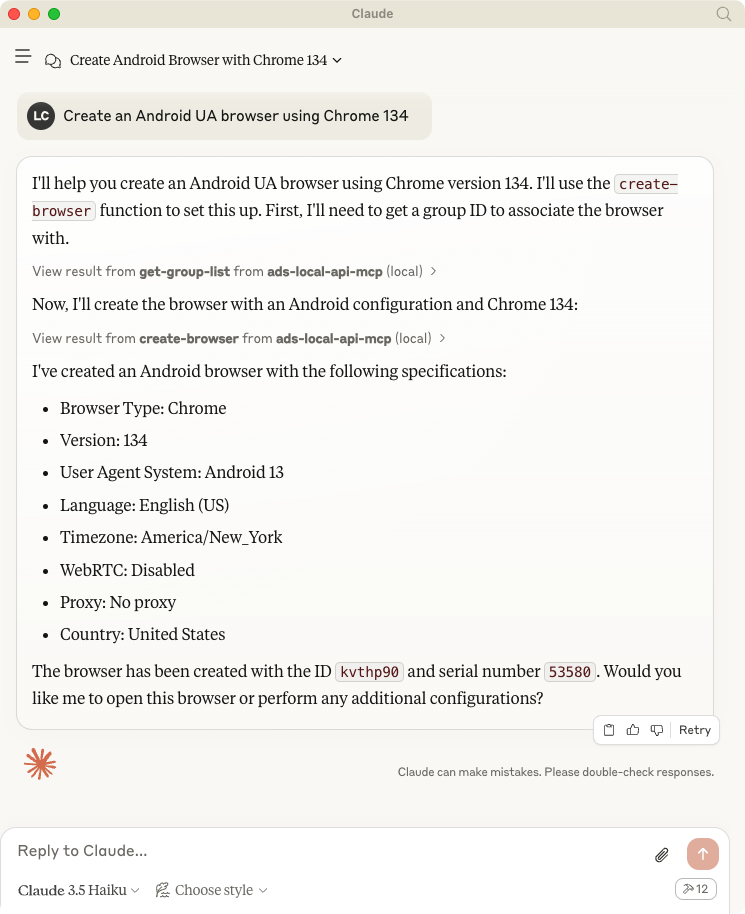
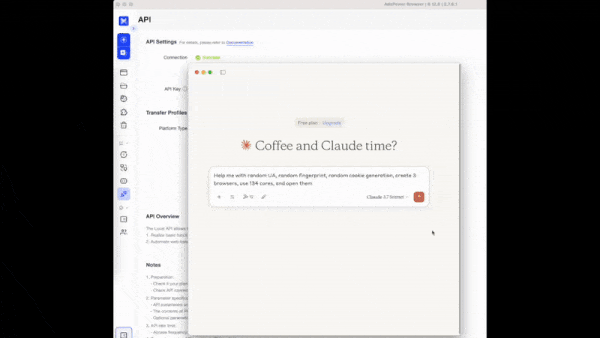
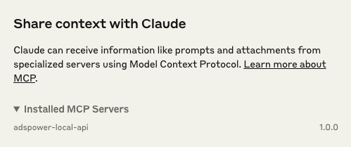

# AdsPower LocalAPI MCP Server

A Model Context Protocol server that AdsPower browser LocalAPI. This server enables LLMs to interact with start browser, create browser, update browser fingerprint config ...


## Usage with Claude Desktop

Talk to LLMs to create browser: `Create an Android UA browser using Chrome 134`



Talk to LLMs to create browser: `Help me with random UA, random fingerprint, random cookie generation, create 3 browsers, use 134 cores, and open them`



### Node

```bash
# git clone 
git clone https://github.com/AdsPower/local-api-mcp-typescript.git

# install package
cd local-api-mcp-typescript && npx pnpm i

# build
npm run build
```

```bash
# Add the server to your claude_desktop_config.json
"mcpServers": {
  "ads-local-api-mcp": {
        "command": "node",
        "args": [
            "<Replace Your Project Path>/local-api-mcp-typescript/build/index.js"
        ]
    }
}
```



## Components

### Tools

- **open_browser**
  - Open the browser
  - Inputs: 
    - `serialNumber` (string, optional): The serial number of the browser to open
    - `userId` (string, optional): The browser id of the browser to open

- **close_browser**
  - Close the browser
  - Input: 
    - `userId` (string): The browser id of the browser to stop

- **create_browser**
  - Create a browser
  - Inputs:
    - `groupId` (string): The group id for the browser
    - `domainName` (string, optional): The domain name
    - `openUrls` (string[], optional): URLs to open
    - `cookie` (string, optional): Browser cookie
    - `username` (string, optional): Username
    - `password` (string, optional): Password
    - `system` (string, optional): System type
    - `name` (string, optional): Browser name
    - `country` (string, optional): Country
    - `sysAppCateId` (string, optional): System application category id
    - `storageStrategy` (number, optional): Storage strategy
    - `userProxyConfig` (object): Proxy configuration
    - `fingerprintConfig` (object, optional): Browser fingerprint configuration

- **update_browser**
  - Update the browser
  - Inputs: Same as create_browser, plus:
    - `userId` (string): The user id of the browser to update

- **delete_browser**
  - Delete the browser
  - Input:
    - `userIds` (string[]): The user ids of the browsers to delete

- **get_browser_list**
  - Get the list of browsers
  - Inputs:
    - `groupId` (string, optional): The group id of the browser
    - `size` (number, optional): The size of the page
    - `id` (string, optional): The id of the browser
    - `serialNumber` (string, optional): The serial number of the browser
    - `sort` (enum, optional): Sort field ('serial_number' | 'last_open_time' | 'created_time')
    - `order` (enum, optional): Sort order ('asc' | 'desc')

- **get-opened_browser**
  - Get the list of opened browsers
  - No inputs required

- **move_browser**
  - Move browsers to a group
  - Inputs:
    - `groupId` (string): The target group id
    - `userIds` (string[]): The browser ids to move

- **create_group**
  - Create a browser group
  - Inputs:
    - `groupName` (string): The name of the group to create
    - `remark` (string, optional): The remark of the group

- **update_group**
  - Update the browser group
  - Inputs:
    - `groupId` (string): The id of the group to update
    - `groupName` (string): The new name of the group
    - `remark` (string | null, optional): The new remark of the group, set null to clear

- **get_group_list**
  - Get the list of groups
  - Inputs:
    - `name` (string, optional): The name of the group
    - `size` (number, optional): The size of the page

- **get-application_list**
  - Get the list of applications
  - Input:
    - `size` (number, optional): The size of the page

### Advanced Configuration Types

#### UserProxyConfig
- `proxy_soft` (enum): The proxy soft type ('brightdata', 'brightauto', 'oxylabsauto', etc.)
- `proxy_type` (enum, optional): Proxy type ('http', 'https', 'socks5', 'no_proxy')
- `proxy_host` (string, optional): Proxy host
- `proxy_port` (string, optional): Proxy port
- `proxy_user` (string, optional): Proxy username
- `proxy_password` (string, optional): Proxy password
- `proxy_url` (string, optional): Proxy URL
- `global_config` (enum, optional): Global config ('0' | '1')

#### FingerprintConfig
- `automatic_timezone` (enum, optional): Automatic timezone ('0' | '1')
- `timezone` (string, optional): Timezone
- `language` (string[], optional): Languages
- `flash` (string, optional): Flash version
- `fonts` (string[], optional): Font list
- `webrtc` (enum, optional): WebRTC setting ('disabled' | 'forward' | 'proxy' | 'local')
- `browser_kernel_config` (object, optional):
  - `version` (string, optional): Browser version
  - `type` (enum, optional): Browser type ('chrome' | 'firefox')
- `random_ua` (object, optional):
  - `ua_version` (string[], optional): User agent versions
  - `ua_system_version` (enum[], optional): System versions
- `tls_switch` (enum, optional): TLS switch ('0' | '1')
- `tls` (string, optional): TLS configuration